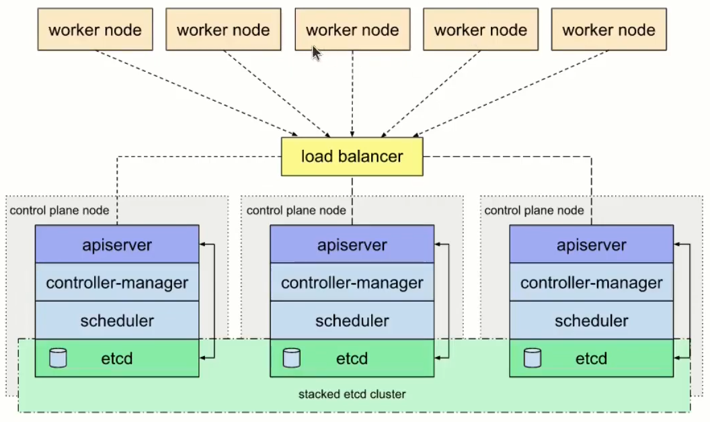
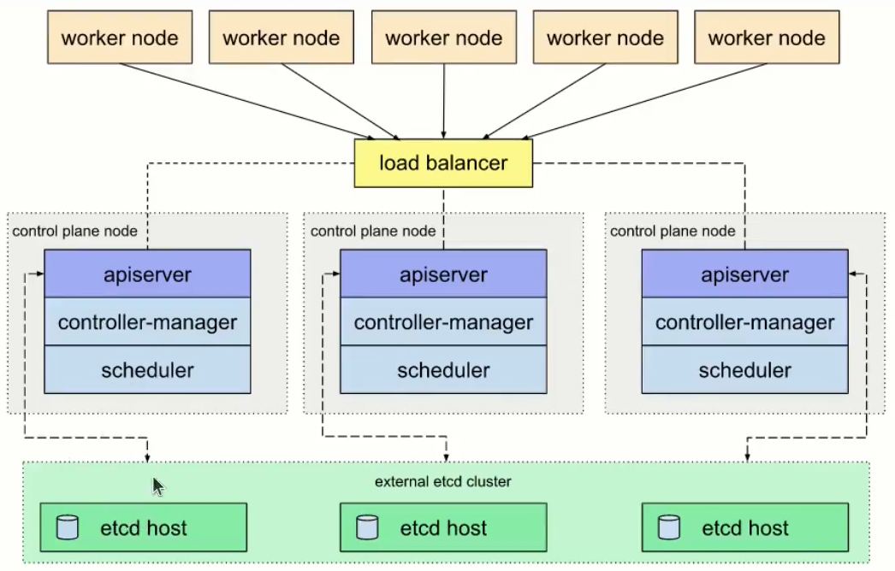

## 1. Các thành phần của K8s
### Master
   - APIServer
   - Controller-manager 
   - Cloud-controller-manager
   - Scheduler
   - Etcd
### Worker 
  - Kubelet
  - Kube-proxy
## 2. Mô hình triển khai
### Stack Etcd
  - Tất cả các thành phần của master bao gồm cả etcd nằm trên node master
  -  Các worker hoặc client kết nối tới apiServer thông qua Loadbalancer

  
### External Etcd
  - etcd nằm riêng với node master



## 3.  Các bước triển khai Kubernetes Cluster với kubeadm
 - Cài đặt container runtime
 - Cài đặt các công cụ  kubectl, kubeadm, kubelet
 - Cấu hình Cgroup drive
 - Cấu hình loadbalancer cho apiServer
 - Khởi tạo kubernetes cluster
 - Cài đặt CNI
 - Thêm master node, woker node
 
* Chuẩn bị
#### Lb
 - 10.0.0.10
#### Master:
 -  10.0.0.1
 -  10.0.0.2
 -  10.0.0.3
#### Worker
 - 10.0.0.4
 - 10.0.0.5
 - 10.0.0.6

# Kubernetes installation scripts

## Setup loadbalancer
```sh
apt install nginx -y
cd /etc/nginx
mkdir k8s-lb.d
cd k8s-lb.d
cat <<EOF | sudo tee /etc/nginx/k8s-lb.d/apiserver.con
stream {
    upstream kubernetes {
        server 10.0.0.100:6443 max_fails=3 fail_timeout=30s;
        server 10.0.0.101:6443 max_fails=3 fail_timeout=30s;
        server 10.0.0.103:6443 max_fails=3 fail_timeout=30s;
    }
    server {
            listen 6443;
            proxy_pass kubernetes;
         }
}
EOF

# Include config to nginx
echo "include /etc/nginx/k8s-lb.d/*;" >> /etc/nginx/nginx.conf
nginx -s reload

```

## Install containerd

```sh
cat <<EOF | sudo tee /etc/modules-load.d/containerd.conf
overlay
br_netfilter
EOF
sudo modprobe overlay
sudo modprobe br_netfilter
cat <<EOF | sudo tee /etc/sysctl.d/99-kubernetes-cri.conf
net.bridge.bridge-nf-call-iptables  = 1
net.ipv4.ip_forward                 = 1
net.bridge.bridge-nf-call-ip6tables = 1
EOF
sudo sysctl --system
sudo apt install containerd -y
mkdir /etc/containerd
containerd config default > /etc/containerd/config.toml
sed -i 's/SystemdCgroup = false/SystemdCgroup = true/g' /etc/containerd/config.toml
systemctl restart containerd
```

## Install kubeadm, kubelet, kubectl

```sh
sudo apt-get update
sudo apt-get install -y apt-transport-https ca-certificates curl
sudo curl -fsSLo /usr/share/keyrings/kubernetes-archive-keyring.gpg https://packages.cloud.google.com/apt/doc/apt-key.gpg
echo "deb [signed-by=/usr/share/keyrings/kubernetes-archive-keyring.gpg] https://apt.kubernetes.io/ kubernetes-xenial main" | sudo tee /etc/apt/sources.list.d/kubernetes.list
sudo apt-get update
sudo apt-get install -y kubelet kubeadm kubectl
sudo apt-mark hold kubelet kubeadm kubectl
```

## Init cluster

```sh
kubeadm init --control-plane-endpoint=lb_ip:6443 --upload-certs --pod-network-cidr=10.0.0.0/8
```
## Upload cert hash
kubeadm init phase upload-certs --upload-certs

## Install cni

```sh
helm repo add cilium https://helm.cilium.io/
helm install cilium cilium/cilium --version 1.11.6 --namespace kube-system
```

## Add master node

```sh
kubeadm join lb_ip:6443 --token oylvmu.12pwimke0blaaeji --discovery-token-ca-cert-hash sha256:303a791ef0bdaeb3a3b54ca80f8f4831dff6d0bb1c43c664d9102c9ec569ef61 --control-plane --certificate-key 3b4da12cd25d1c1e7a47abcb908c73405c4abd5e542f99692d8f1b9d368d307a
```

## Add worker node

```sh
kubeadm join lb_ip:6443 --token 9vr73a.a8uxyaju799qwdjv --discovery-token-ca-cert-hash sha256:7c2e69131a36ae2a042a339b33381c6d0d43887e2de83720eff5359e26aec866
```

## Get token list

```sh
kubeadm token list
```

## Create token

```sh
kubeadm token create
```

## Discovery token ca cert hash

```sh
openssl x509 -pubkey -in /etc/kubernetes/pki/ca.crt | openssl rsa -pubin -outform der 2>/dev/null | \
openssl dgst -sha256 -hex | sed 's/^.* //'
```
