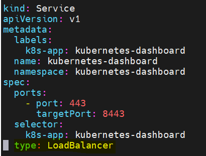

# install dashboard for kubernetes

kubectl apply -f <https://raw.githubusercontent.com/kubernetes/dashboard/v2.7.0/aio/deploy/recommended.yaml>

## customize to access external

wget <https://raw.githubusercontent.com/kubernetes/dashboard/v2.7.0/aio/deploy/recommended.yaml>

edit file "recommended.yaml" go to line 45 and add line below:

type: LoadBalancer  #suported values: "ClusterIP", "ExternalName", "LoadBalancer", "NodePort"



### Get address and port to login

```sh
kubectl get services -n kubernetes-dashboard
```

## Create Admin-user

```sh
touch dashboard-admin-user.yml
cat <<EOF | tee dashboard-admin-user.yaml
# Create Service account with name admin-user in namespace "kubernetes-dashboard"
apiVersion: v1
kind: ServiceAccount
metadata:
  name: admin-user
  namespace: kubernetes-dashboard
---
# Creating a ClusterRoleBinding
apiVersion: rbac.authorization.k8s.io/v1
kind: ClusterRoleBinding
metadata:
  name: admin-user
roleRef:
  apiGroup: rbac.authorization.k8s.io
  kind: ClusterRole
  name: cluster-admin
subjects:

- kind: ServiceAccount
  name: admin-user
  namespace: kubernetes-dashboard
EOF
```


# Getting a Bearer Token
```sh
kubectl -n kubernetes-dashboard create token admin-user
```
# get admin-user token
```sh
kubectl get secret -n kubernetes-dashboard $(kubectl get serviceaccount admin-user -n kubernetes-dashboard -o jsonpath="{.secrets[0].name}") -o jsonpath="{.data.token}" | base64 --decode
```

Now copy the token and paste it into the Enter token field login screen


### Create Read-only user
```sh
cat << EOF | tee dashboard-readonly-user 
apiVersion: v1
kind: ServiceAccount
metadata:
  name: read-only-user
  namespace: kubernetes-dashboard
---
apiVersion: rbac.authorization.k8s.io/v1
kind: ClusterRole
metadata:
  annotations:
    rbac.authorization.kubernetes.io/autoupdate: "true"
  labels:
  name: read-only-clusterrole
  namespace: default
rules:

- apiGroups:
  - ""
  resources: ["*"]
  verbs:
  - get
  - list
  - watch
- apiGroups:
  - extensions
  resources: ["*"]
  verbs:
  - get
  - list
  - watch
- apiGroups:
  - apps
  resources: ["*"]
  verbs:
  - get
  - list
  - watch

---
apiVersion: rbac.authorization.k8s.io/v1
kind: ClusterRoleBinding
metadata:
  name: read-only-binding
roleRef:
  kind: ClusterRole
  name: read-only-clusterrole
  apiGroup: rbac.authorization.k8s.io
subjects:

- kind: ServiceAccount
  name: read-only-user
  namespace: kubernetes-dashboard
EOF
```
And deploy the read-only-user with command below:
```
kubectl apply -f dashboard-read-only.yaml
```
To allow users to log in via the read-only account, you’ll need to provide a token which can be fetched using the next command
```
kubectl get secret -n kubernetes-dashboard $(kubectl get serviceaccount read-only-user -n kubernetes-dashboard -o jsonpath="{.secrets[0].name}") -o jsonpath="{.data.token}" | base64 --decode
```

# Stopping the dashboard
```
kubectl delete -f dashboard-admin.yaml
kubectl delete -f dashboard-read-only.yaml
kubectl apply -f https://raw.githubusercontent.com/kubernetes/dashboard/v2.7.0/aio/deploy/recommended.yaml
```

# Setting up management script

[dashboard.sh](https://github.com/luudinhmac/install-kubernetes/blob/master/setup/dashboard/dashboard.sh)

Make script executable
```sh
chmod +x ~/dashboard/dashboard.sh
```
> Create symbolic link to the dashboard to be able run it anywhere on the system 
```sh
sudo ln -s ~/dashboard/dashboard.sh /usr/local/bin/dashboard
```
Start the dashboard and show the tokens
```sh
dashboard start
```
Check whether the dashboard is running or not and output the tokens if currently set.
```sh
dashboard status
```
Stop the dashboard
```sh
dashboard stop
```
